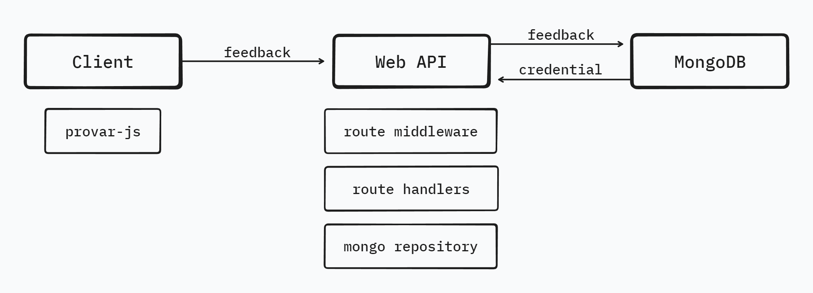

# Architecture

This is a web api where users would send feedback to store in the database.

This application is built using the following frameworks and libraries:

- **Fiber:** An express-like framework built on Go with good performance. [Read more](https://gofiber.io)

## Authentication

Incoming requests are authenticated using JWT access tokens or api keys. Users would create API keys by logging into the Provar Webapp.

## Persisting Data

The application uses PostgreSQL to persist data which is hosted by Neon. Check `*_repository.go` files for code using the database.

## Deployment (prod)

For deployment, we leverage GitHub Actions to automate the deployment process. Currently, the deployment is targeted only to the production environment as a staging environment is not yet in place. The deployment workflow involves using Google Cloud Platform services:

- **Google Cloud Artifact Registry:** This is used to store Docker images, ensuring a centralized repository for our application's container images. Repositories are configured to automatically delete older docker images.
- **Google Cloud Run:** Our service is deployed and run on Google Cloud Run, which provides a serverless environment for containerized applications. This allows for scalability and ease of management without worrying about infrastructure.

The deployment pipeline involves continuous integration and deployment using GitHub Actions, enabling seamless updates to the production environment.
